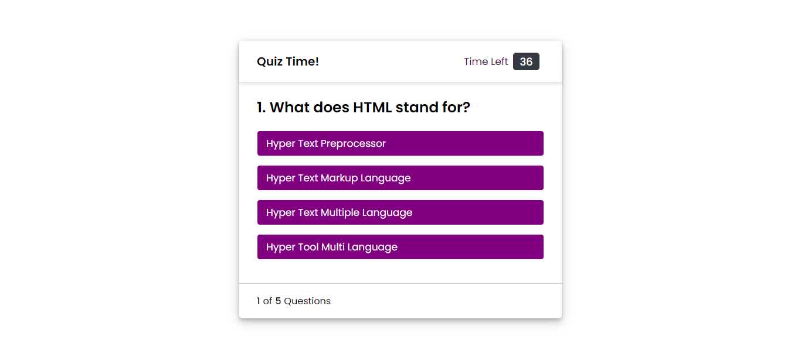

# quiz
This is a quiz for someone to test their knowledge on coding. There are five questions with 60 seconds to answer.

People can play competitively from the same computer to see who's able to beat the scores on the scoreboard.

## Contents
Section | Description
------------ | -------------
[Screenshot](#screenshot) | Screenshots of the quiz and links to the working site & repo.
[Functionality](#functionality) | Information on the functionality of the quiz.
[Licence](#licence) | Licence for the source code

## Screenshot

You can access the site via [this link](https://kvtemadden.github.io/quiz/)

And you can access the GitHub Repo via [this link](https://github.com/kvtemadden/quiz)

## Functionality
The quiz works by clicking a start button which opens up an introductory screen.

This tells the user how the quiz works and gives them the option to view the highscores, exit the quiz or start the quiz.

When they start the quiz, the questions are displayed and the timer starts counting down from 60.

The user answers 5 questions and if they answer them incorrectly then the timer -5 seconds each time this occurs.

Once the user reaches the end, they're given their score and prompted to input their initials to save their score.

If they choose to and click submit, their score and initials will be stored on a scoreboard which is accessible from the info page & when a user completes the quiz again.

There are restrictions on the initials to ensure they're no more than 3 characters long, nor left blank.

The user can replay the quiz if they'd like another go by using the restart buttons.

## Licence
> This site was created under the standard MIT licence.

